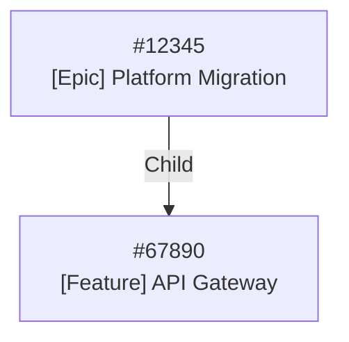
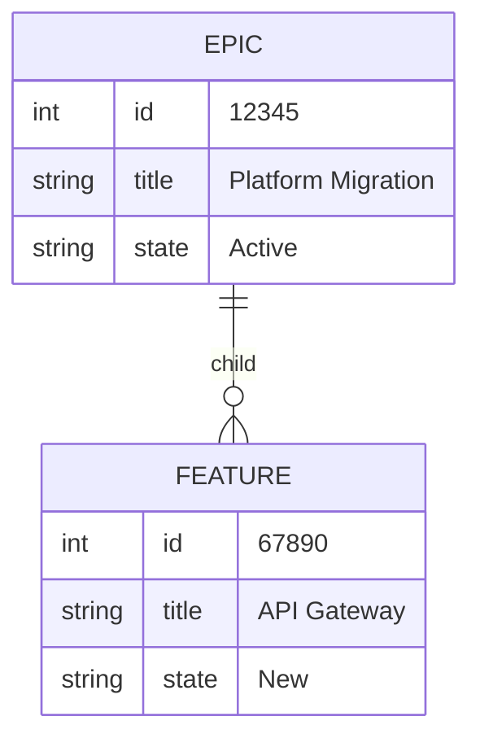
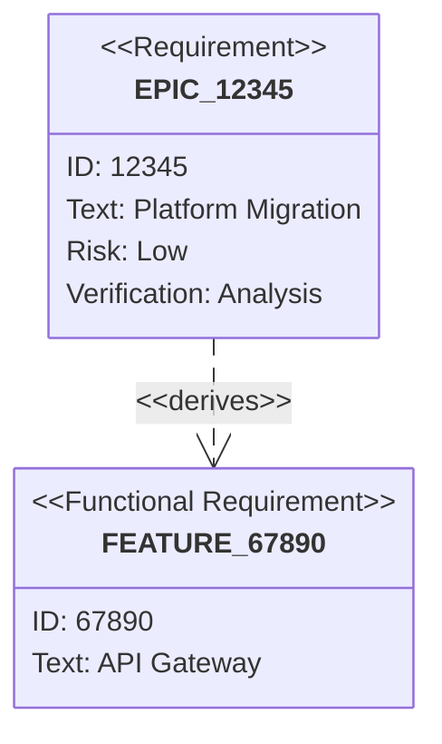
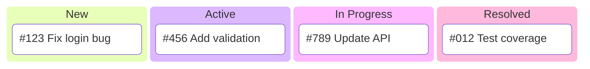
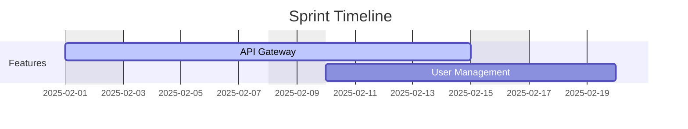

# Visualizing Work Item Results

This document explains all available visualization formats and options for the
`azdw visualize graph` command. Use this reference when generating visual
representations of work item relationships.

## Quick Reference

| Format | Extension | Best For | Rendering |
| ------ | --------- | -------- | --------- |
| `graphviz` | `.dot` | Print/PDF, simple graphs | Requires GraphViz to render |
| `graph` | `.json` | Web apps, D3.js, Gephi | Load in visualization tool |
| `graphml` | `.graphml` | yEd, Gephi, Cytoscape | Open in graph editor |
| `mermaid-flowchart` | `.mmd` | Markdown docs, GitHub | Native Markdown rendering |
| `mermaid-er` | `.mmd` | Entity relationships | Native Markdown rendering |
| `mermaid-requirement` | `.mmd` | Requirements traceability | Native Markdown rendering |
| `mermaid-kanban` | `.mmd` | Sprint boards | Native Markdown rendering |
| `mermaid-gantt` | `.mmd` | Timeline/schedule | Native Markdown rendering |

## Command Syntax

```bash
azdw visualize graph [options]
```

### Input Modes

**ID-based mode** — visualize specific work items:
```bash
azdw visualize graph \
  --ids 12345 67890 \
  --connection MyOrg \
  --format graphviz \
  --output graph.dot
```

**Query-based mode** — visualize items matching filters:
```bash
azdw visualize graph \
  --types Bug Feature \
  --states Active \
  --format graphviz \
  --output bugs.dot
```

**From closure file** — visualize a pre-computed closure:
```bash
azdw visualize graph \
  --from-closure closure.json \
  --format mermaid-flowchart \
  --output hierarchy.mmd
```

**From JSON file** — visualize from exported work items:
```bash
azdw visualize graph \
  --from-file workitems.json \
  --format graphml \
  --output graph.graphml
```

## Output Formats

### GraphViz DOT (`--format graphviz`)

Generates `.dot` files that can be rendered to PNG, SVG, or PDF using GraphViz.

```bash
# Generate DOT file
azdw visualize graph \
  --ids 12345 \
  --connection MyOrg \
  --format graphviz \
  --layout tree \
  --direction TB \
  --show-legend \
  --title "Work Item Hierarchy" \
  --output hierarchy.dot

# Render to various formats
dot -Tpng hierarchy.dot -o hierarchy.png
dot -Tsvg hierarchy.dot -o hierarchy.svg
dot -Tpdf hierarchy.dot -o hierarchy.pdf
```

**Layout options** (`--layout`):
- `graph` — General graph layout (default)
- `tree` — Hierarchical tree layout for parent/child relationships
- `network` — Cluster layout for cross-organizational networks

**Direction options** (`--direction`):
- `TB` — Top to bottom (default)
- `LR` — Left to right
- `BT` — Bottom to top
- `RL` — Right to left

**Node coloring**: Nodes are colored by work item type:
- Epic: Light blue
- Feature: Light green  
- User Story: Light yellow
- Task: Light coral/red
- Bug: Light pink
- Test Case: Light gray

**Cross-connection support**: By default, relationships spanning multiple 
organizations are included. Use `--no-cross-conn` to disable.

### JSON Graph (`--format graph`)

Generates JSON files for D3.js, Gephi, or custom web applications.

```bash
azdw visualize graph \
  --ids 12345 67890 \
  --connection MyOrg \
  --format graph \
  --by-conn \
  --output network.json
```

**Output structure**:
```json
{
  "nodes": [
    {
      "id": "12345",
      "label": "#12345\nEpic\nPlatform Migration",
      "group": "Epic",
      "color": "#93c5fd",
      "size": 16,
      "metadata": {
        "state": "Active",
        "assignedTo": "user@example.com",
        "project": "MyProject",
        "webUrl": "https://dev.azure.com/..."
      }
    }
  ],
  "links": [
    {
      "source": "12345",
      "target": "67890",
      "label": "Child",
      "value": 2,
      "color": "#3b82f6",
      "metadata": {
        "relationshipType": "System.LinkTypes.Hierarchy-Forward"
      }
    }
  ]
}
```

**Link colors by relationship type**:
- Hierarchy (Parent/Child): Blue (`#3b82f6`)
- Dependency (Predecessor/Successor): Green (`#10b981`)
- Related: Purple (`#a855f7`)
- Hyperlink: Orange (`#f97316`)

### GraphML (`--format graphml`)

Generates XML-based GraphML files for professional graph tools like yEd, Gephi,
and Cytoscape.

```bash
# Standard GraphML
azdw visualize graph \
  --ids 12345 \
  --connection MyOrg \
  --format graphml \
  --output network.graphml

# yEd-optimized with colored shapes and groups
azdw visualize graph \
  --ids 12345 \
  --connection MyOrg \
  --format graphml \
  --optimize-for-yed \
  --by-conn \
  --output dependencies.graphml
```

**yEd optimization** (`--optimize-for-yed`):
- Adds yEd-specific namespaces and styling
- Includes colored node shapes based on work item type
- Creates group containers for organization/project grouping
- Apply hierarchical layout in yEd for best results

### Mermaid Flowchart (`--format mermaid-flowchart`)

Generates Mermaid flowchart syntax that renders natively in GitHub, GitLab, and
documentation tools.

```bash
azdw visualize graph \
  --ids 12345 67890 \
  --connection MyOrg \
  --format mermaid-flowchart \
  --direction TB \
  --show-legend \
  --title "Sprint Work Items" \
  --output hierarchy.mmd
```

**Output**:


**Embedding in Markdown**:
````markdown

````

### Mermaid ER Diagram (`--format mermaid-er`)

Shows work item types as entities with their relationships.

```bash
azdw visualize graph \
  --ids 12345 67890 \
  --connection MyOrg \
  --format mermaid-er \
  --title "Work Item Relationships" \
  --output relationships.mmd
```

**Output**:


### Mermaid Requirement Diagram (`--format mermaid-requirement`)

Visualizes traceability between requirements, tests, and implementation.

```bash
azdw visualize graph \
  --ids 12345 \
  --connection MyOrg \
  --format mermaid-requirement \
  --max-depth 3 \
  --title "Traceability Matrix" \
  --output traceability.mmd
```

**Output**:


**Work item type mapping**:
- Epic, Requirement → `requirement`
- Feature, User Story, Product Backlog Item → `functionalRequirement`
- Task, Bug, Test Case, Issue → `element`

### Mermaid Kanban (`--format mermaid-kanban`)

Displays work items grouped by state in a Kanban board layout.

```bash
azdw visualize graph \
  --types Bug Task \
  --assigned-to "@me" \
  --format mermaid-kanban \
  --kanban-state-order "New,Active,In Progress,Resolved,Closed" \
  --title "My Sprint Board" \
  --output board.mmd
```

**Output**:


**State ordering**: Use `--kanban-state-order` to customize column order.
Default order: New, Active, In Progress, Resolved, Closed, Done, Removed

### Mermaid Gantt (`--format mermaid-gantt`)

Creates timeline visualizations based on work item dates.

```bash
azdw visualize graph \
  --types Feature "User Story" \
  --states Active "In Progress" \
  --format mermaid-gantt \
  --exclude-weekends \
  --title "Sprint Timeline" \
  --output timeline.mmd
```

**Output**:


**Date fields used** (in priority order):
- Start: StartDate, System.ActivatedDate
- End: TargetDate, Due Date, Finish Date

**Options**:
- `--exclude-weekends`: Excludes weekends from the timeline

## Relationship Filtering

Control which relationships to include in the visualization:

```bash
# Hierarchy only (parent/child)
azdw visualize graph --ids 12345 -c MyOrg --hierarchy-only

# Dependencies only (predecessor/successor)  
azdw visualize graph --ids 12345 -c MyOrg --dependencies-only

# Related links only
azdw visualize graph --ids 12345 -c MyOrg --related-only

# Cross-connection relationships only
azdw visualize graph --ids 12345 -c MyOrg --cross-conn-only

# Specific relationship types
azdw visualize graph --ids 12345 -c MyOrg --relationship-types Child Related

# All relationships (default)
azdw visualize graph --ids 12345 -c MyOrg --all-relationships
```

## Depth Control

Limit how many levels of relationships to traverse:

```bash
# Traverse up to 3 levels deep
azdw visualize graph --ids 12345 -c MyOrg --max-depth 3 --format graphviz
```

## Grouping Options

Group nodes in the visualization:

```bash
# Group by connection/organization
azdw visualize graph --ids 12345 -c MyOrg --by-conn --format graphviz

# Group by project
azdw visualize graph --ids 12345 -c MyOrg --by-project --format graphviz
```

## Additional Node Information

Add extra fields to node labels:

```bash
# Include custom fields in nodes
azdw visualize graph \
  --ids 12345 \
  --connection MyOrg \
  --node-fields System.State System.AssignedTo \
  --format graphviz \
  --output detailed.dot

# Include PII (assigned user names)
azdw visualize graph \
  --ids 12345 \
  --connection MyOrg \
  --include-pii \
  --format graphviz
```

## Cross-Connection Relationships

By default, azdw resolves relationships across multiple Azure DevOps
organizations. Control this behavior:

```bash
# Include cross-connection relationships (default)
azdw visualize graph --ids 12345 -c MyOrg --format graphviz

# Disable cross-connection resolution
azdw visualize graph --ids 12345 -c MyOrg --no-cross-conn --format graphviz

# Also resolve hyperlinks to work items
# (enabled by default, disable with --no-resolve-hyperlinks)
azdw visualize graph --ids 12345 -c MyOrg --no-resolve-hyperlinks

# Resolve custom field references
azdw visualize graph --ids 12345 -c MyOrg --resolve-field-refs

# Resolve file content for relationships
azdw visualize graph --ids 12345 -c MyOrg --resolve-file-content
```

## Custom Styling

Apply custom color maps:

```bash
azdw visualize graph \
  --ids 12345 \
  --connection MyOrg \
  --color-map /path/to/colors.json \
  --format graphviz
```

## AI-Powered Queries

Use natural language to define visualization scope:

```bash
azdw visualize graph \
  --ai-query "all active bugs assigned to me from the last sprint" \
  --format mermaid-flowchart \
  --output my-bugs.mmd
```

## Complete Examples

### Epic Hierarchy Tree

```bash
# Generate a tree of an epic and all its children
azdw visualize graph \
  --ids 12345 \
  --connection MyOrg \
  --format graphviz \
  --layout tree \
  --direction TB \
  --hierarchy-only \
  --max-depth 4 \
  --show-legend \
  --title "Epic 12345 Hierarchy" \
  --output epic-tree.dot

# Render to PNG
dot -Tpng epic-tree.dot -o epic-tree.png
```

### Cross-Organization Dependencies

```bash
# Visualize dependencies spanning multiple organizations
azdw visualize graph \
  --ids 12345 67890 \
  --connection PrimaryOrg \
  --format graphviz \
  --layout network \
  --dependencies-only \
  --by-conn \
  --show-legend \
  --title "Cross-Org Dependencies" \
  --output cross-org-deps.dot
```

### Sprint Kanban Board in Markdown

```bash
# Generate Kanban for documentation
azdw visualize graph \
  --iteration "@CurrentIteration" \
  --format mermaid-kanban \
  --kanban-state-order "New,Active,In Progress,Resolved,Done" \
  --title "Sprint 2025.Q1.3" \
  --output sprint-board.mmd

# The output can be embedded directly in any Markdown document
```

### Feature Timeline

```bash
# Generate Gantt chart for features
azdw visualize graph \
  --types Feature \
  --states Active "In Progress" \
  --format mermaid-gantt \
  --exclude-weekends \
  --title "Feature Roadmap Q1 2025" \
  --output roadmap.mmd
```

### yEd-Ready GraphML

```bash
# Generate GraphML optimized for yEd
azdw visualize graph \
  --types Epic Feature \
  --format graphml \
  --optimize-for-yed \
  --by-project \
  --title "Portfolio Overview" \
  --output portfolio.graphml

# Open in yEd and apply:
# Layout → Hierarchical → Classic
```

## Rendering Tools

### GraphViz

Install: `brew install graphviz` (macOS) or `apt install graphviz` (Linux)

```bash
dot -Tpng input.dot -o output.png
dot -Tsvg input.dot -o output.svg
dot -Tpdf input.dot -o output.pdf
```

### Mermaid CLI

Install: `npm install -g @mermaid-js/mermaid-cli`

```bash
mmdc -i input.mmd -o output.svg
mmdc -i input.mmd -o output.png
```

### D3.js (for JSON graphs)

Load the JSON file and use D3's force-directed graph:

```javascript
d3.json("network.json").then(data => {
  const simulation = d3.forceSimulation(data.nodes)
    .force("link", d3.forceLink(data.links).id(d => d.id))
    .force("charge", d3.forceManyBody())
    .force("center", d3.forceCenter(width/2, height/2));
});
```

### yEd Graph Editor

1. Open `.graphml` file in yEd
2. Apply layout: Layout → Hierarchical → Classic
3. Export to SVG, PNG, or PDF

## See Also

- [SKILL.md](SKILL.md) — Main skill overview
- [CLI-REFERENCE.md](CLI-REFERENCE.md) — Full CLI command reference
- [MCP-TOOLS.md](MCP-TOOLS.md) — MCP tool reference
- [CREATE-REPORT-TEMPLATE.md](CREATE-REPORT-TEMPLATE.md) — Report template creation
