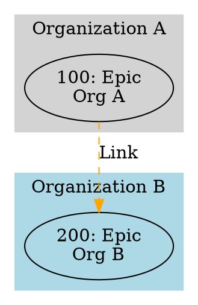

# Cross-Connectional Relationship Handling in azdw

## Table of Contents

- [Executive Summary](#executive-summary)
- [Current Implementation Overview](#current-implementation-overview)
  - [Architecture](#architecture)
  - [Key Features](#key-features)
    - [1. Multi-Connection Management](#1-multi-connection-management)
    - [2. Relationship Resolution Engine](#2-relationship-resolution-engine)
    - [2.1 Remote Work Link Types Support](#21-remote-work-link-types-support)
    - [3. Hyperlink Resolution Feature](#3-hyperlink-resolution-feature)
    - [3.1 Field-Based Work Item Reference Resolution](#31-field-based-work-item-reference-resolution)
    - [3.2 File-Based Relationship Mapping](#32-file-based-relationship-mapping)
    - [4. Cross-Organizational Filtering](#4-cross-organizational-filtering)
    - [5. Relationship Metadata](#5-relationship-metadata)
- [CLI Usage](#cli-usage)
  - [Basic Relationship Resolution](#basic-relationship-resolution)
  - [Cross-Organizational Queries](#cross-organizational-queries)
  - [Relationship Analysis](#relationship-analysis)
  - [Visualization](#visualization)
- [CLI Options Reference](#cli-options-reference)
  - [Relationship Command Options](#relationship-command-options)
  - [Visualization Command Options](#visualization-command-options)
- [Programmatic Usage](#programmatic-usage)
  - [.NET Library API](#net-library-api)
  - [REST API](#rest-api)
  - [GraphQL API](#graphql-api)
- [How Cross-Organizational Relationships Work](#how-cross-organizational-relationships-work)
  - [Scenario 1: Native Azure DevOps Relationships](#scenario-1-native-azure-devops-relationships)
  - [Scenario 2: Cross-Org via Hyperlinks](#scenario-2-cross-org-via-hyperlinks)
  - [Scenario 3: Multi-Level Cross-Org Hierarchy](#scenario-3-multi-level-cross-org-hierarchy)
- [TFS (Team Foundation Server) Support](#tfs-team-foundation-server-support)
  - [TFS URL Format](#tfs-url-format)
  - [TFS Connection Configuration](#tfs-connection-configuration)
  - [How Connection Matching Works](#how-connection-matching-works)
  - [Hybrid Cloud + TFS Scenarios](#hybrid-cloud--tfs-scenarios)
  - [TFS-Specific Considerations](#tfs-specific-considerations)
  - [Example: Multi-Org + TFS Query](#example-multi-org--tfs-query)
  - [Scenario 4: Multi-Level Cross-Org Hierarchy (Legacy Naming)](#scenario-4-multi-level-cross-org-hierarchy-legacy-naming)
- [Visualization Support](#visualization-support)
  - [GraphViz Rendering](#graphviz-rendering)
  - [Interactive HTML Dashboards](#interactive-html-dashboards)
- [Configuration](#configuration)
  - [Connection Setup](#connection-setup)
  - [Multi-Tenant Authentication](#multi-tenant-authentication)
- [Permissions Required](#permissions-required)
- [Limitations and Considerations](#limitations-and-considerations)
  - [Current Limitations](#current-limitations)
  - [Performance Considerations](#performance-considerations)
  - [Best Practices](#best-practices)
- [Future Enhancement Opportunities](#future-enhancement-opportunities)
- [Conclusion](#conclusion)
- [Related Documentation](#related-documentation)

## Executive Summary

The `azdw` tool **currently implements comprehensive cross-connection work item relationship handling** with sophisticated support for resolving relationships across different Azure DevOps organizations and Entra ID tenants. The tool uses a **four-track approach** for cross-connection relationships:

1. **Native Azure DevOps Relationships**: Standard work item links (Parent, Child, Related, Dependency, etc.) stored directly in Azure DevOps
2. **Remote Work Link Types**: Azure DevOps native cross-organizational link types (Remote-Related, Produces-For, Consumes-From) designed for linking work items across organizations managed by the same Microsoft Entra ID
3. **Hyperlink-based Relationships**: Work item URLs stored as "Hyperlink" entries that are automatically detected and resolved as relationships to remote work items
4. **File-based Relationships**: Hyperlinks to non-work-item resources (Git files, Wiki pages, external documents) converted to navigable "fake" work item relationships via configurable regex patterns

This multi-track approach enables teams to reference work items across organizational boundaries using native Azure DevOps functionality when available (Remote Work Link Types), or fallback to hyperlink-based resolution when organizations are in different tenants or for legacy scenarios. The file-based relationship mapping extends this to architecture artifacts stored outside Azure DevOps work items.

The tool provides a **unified visualization command** (`visualize graph`) that supports multiple output formats (GraphViz DOT, D3/Gephi JSON) and layout styles (general graph, hierarchical tree, network clustering) for flexible cross-connection visualizations.

## Current Implementation Overview

### Architecture

The cross-connection relationship resolution is implemented in the following components:

```
WorkItemRelationshipService
├── ResolveRelationshipsAsync()           // Main orchestration
│   ├── ProcessWorkItemRelationshipsAsync() // Processes each work item
│   │   ├── ProcessSingleRelationshipAsync()  // Handles native relationships
│   │   └── ProcessHyperlinksAsync()          // Handles hyperlink-based relationships
│   └── ExtractWorkItemInfoFromUrl()       // Parses Azure DevOps URLs
│
RelationshipFilter
├── IncludeCrossConnection. (bool)        // Enable/disable cross-org traversal
├── ResolveHyperlinks (bool)              // Enable/disable hyperlink resolution
├── ResolveFieldReferences (bool)         // Enable/disable field reference extraction
├── LimitToConnections (List<string>)     // Restrict to specific connections
├── MaxDepth (int?)                       // Control traversal depth
└── RelationshipTypes (List<string>)      // Filter by relationship type

WorkItemRelationship
├── IsCrossConnection (bool)              // Identifies cross-connection links
├── SourceConnection (string)             // Source connection name
├── TargetConnection (string)             // Target connection name
├── RelationType (string)                 // Type (including "Hyperlink-WorkItem")
└── IsExternal (bool)                     // Alternative cross-connection flag
```

### Key Features

#### 1. **Multi-Connection Management**

The tool supports multiple Azure DevOps organizations, each with independent authentication:

- **Connection per Organization**: Each Azure DevOps organization is configured as a separate connection
- **Multi-Tenant Support**: Organizations can be in different Entra ID tenants
- **Flexible Authentication**: Supports PAT tokens, OAuth2 Device Code Flow, and Interactive Browser authentication
- **Per-Organization Credentials**: Each connection has its own credential storage

#### 2. **Relationship Resolution Engine**

**Key Capabilities**:

- **Depth-Limited Traversal**: Configurable maximum depth to control recursive relationship resolution
- **Cycle Detection**: Tracks visited items to prevent infinite loops in circular relationships
- **Cross-Org Filtering**: Can include or exclude cross-organization relationships
- **Partial Success**: Continues resolution even if some organizations are unreachable
- **Multi-Connection Traversal**: Automatically switches between connections when following relationships

##### **Remote Work Link Types Support**

Full support for Azure DevOps Remote Work Link Types, which are designed specifically for cross-organizational relationships.

**What are Remote Work Link Types?**

Remote Work Link Types are native Azure DevOps link types that enable work items to be linked across different organizations managed by the same Microsoft Entra ID (formerly Azure AD). These are different from both regular work item links (which only work within the same organization) and hyperlinks.

**Available Remote Link Types**:

| Link Type      | Reference Name                               | Display Name | Topology | Use Case |
| -------------- | -------------------------------------------- | ------------ | -------- | -------- |
| Remote Related | `System.LinkTypes.Remote.Related`            | Remote-Related | Network | Nondirectional link to relate work items across organizations |
| Produces For   | `System.LinkTypes.Remote.Dependency-Forward` | Produces-For | Dependency | Directional link indicating one organization produces work for another |
| Consumes From  | `System.LinkTypes.Remote.Dependency-Reverse` | Consumes-From | Dependency | Reverse of Produces For |

**Key Characteristics**:

- **Cross-Organizational**: Designed specifically for linking work items in different Azure DevOps organizations
- **Same Entra ID Required**: Both organizations must be managed by the same Microsoft Entra ID tenant
- **Native Support**: Unlike hyperlinks, these are first-class work item links recognized by Azure DevOps
- **Counted Separately**: The "Remote Link Count" field tracks these relationships

**Visual Distinction**:

The tool provides distinct visualization for Remote Work Link Types:

- **Remote-Related**: Dark orange color with bold lines (distinct from regular Related links)
- **Produces-For / Consumes-From**: Dark green color with bold-dotted lines (distinct from regular Dependencies)
- **Clear Labels**: Edges are labeled with friendly names ("Remote Related", "Produces For", "Consumes From")

**How azdw Handles Remote Work Link Types**:

The tool automatically:
1. **Recognizes** Remote Work Link Types when parsing work item relationships from Azure DevOps
2. **Maps** them to friendly names (Remote-Related, Produces-For, Consumes-From)
3. **Identifies** them as cross-organizational relationships (IsExternal = true)
4. **Visualizes** them with distinct colors and styles in GraphViz outputs
5. **Tracks** them separately in relationship statistics

**Example Use Case**:

```
Organization A (Shared Services Team)
┌────────────────────────────────┐
│ Work Item 100                  │
│ Type: API Service              │────────────────┐
│                                │                │
└────────────────────────────────┘                │
                                                  │ Produces-For
                                                  │
                                                  ▼
                                    ┌────────────────────────────────┐
                                    │ Work Item 200                  │
                                    │ Type: Product Feature          │
                                    │                                │
                                    └────────────────────────────────┘
                                    Organization B (Product Team)
```

In this scenario:
- Organization A provides shared services (API, infrastructure)
- Organization B builds products that consume these services
- The "Produces-For" remote link explicitly captures this dependency relationship
- Both organizations can see and track this cross-org dependency
- azdw visualizes this with a dark green, bold-dotted line labeled "Produces For"

**Requirements**:

- Both organizations must be in the same Microsoft Entra ID tenant
- User must have appropriate permissions in both organizations
- azdw must have connections configured for both organizations

**Comparison with Other Cross-Org Approaches**:

| Approach               | Native Support | Works Cross-Tenant | Counted in Fields | Requires Same Entra ID |
| ---------------------- | -------------- | ------------------ | ----------------- | ---------------------- |
| Remote Work Link Types | ✅ Yes          | ❌ No               | ✅ Yes (Remote Link Count) | ✅ Required |
| Hyperlink Resolution   | ⚠️ Partial     | ✅ Yes              | ✅ Yes (Hyperlink Count) | ❌ Not required |
| Regular Work Links     | ✅ Yes          | ❌ No               | ✅ Yes (Related Link Count) | ✅ Same org only |

**When to Use Remote Work Link Types**:

- Organizations are in the same Entra ID tenant
- You want native Azure DevOps relationship tracking
- You need bidirectional visibility of cross-org relationships
- You want Azure DevOps to enforce relationship constraints

**When to Use Hyperlink Resolution**:

- Organizations are in different Entra ID tenants
- You need maximum flexibility
- You're working with legacy systems or external partners
- Organizations don't have native Remote Work Link Type support enabled

#### 3. **Hyperlink Resolution Feature**

**The most significant feature for cross-organization scenarios** is the automatic hyperlink resolution.

**What This Means**:

When users add a hyperlink to a work item in Organization A that points to a work item in Organization B (or a TFS server), the tool:

1. **Detects** the hyperlink during relationship resolution
2. **Parses** the Azure DevOps or TFS URL to extract organization/collection, project, and work item ID
3. **Converts** the hyperlink to a relationship of type `Hyperlink-WorkItem`
4. **Resolves** the target work item using the appropriate connection
5. **Traverses** recursively if depth limits allow

**Supported URL Formats**:

Supports:
- Legacy format: `https://{org}.visualstudio.com/{project}/_workitems/edit/{id}`
- Modern format: `https://dev.azure.com/{org}/{project}/_workitems/edit/{id}`
- TFS format: `https://{host}/tfs/{collection}/{project}/_workitems/edit/{id}` (HTTP also supported)

**Creating Hyperlinks (write path)**:

In addition to *resolving* existing hyperlinks, the tool can *create* hyperlinks on work
items. This is the recommended way to establish a cross-organization link from an Azure
DevOps work item to a target in a different tenant or provider (for example a GitHub
Enterprise issue), where native Remote Work Link Types are unavailable. The target URL is
arbitrary, so any HTTP(S) resource can be linked. Once created, the hyperlink is picked up
by the resolution feature above on the next traversal.

The capability is available across all surfaces:

- **CLI**: `azdw workitem update <id> --connection <conn> --add-hyperlink <url> [--hyperlink-comment <text>]`
  and `--remove-hyperlink <url>` (both accept multiple values).
- **Work item spec files**: a relation entry with `"type": "hyperlink"` and `"targetUrl": "<url>"`.
- **MCP tools**: `AddWorkItemHyperlink` / `RemoveWorkItemHyperlink` (approval-gated, high risk).
- **REST API**: `POST /api/v1/workitems/{sourceId}/hyperlinks` and
  `DELETE /api/v1/workitems/{sourceId}/hyperlinks`.
- **GraphQL**: `addHyperlink` / `removeHyperlink` mutations.

#### 3.1. **Field-Based Work Item Reference Resolution**

In addition to hyperlink resolution, the tool supports **automatic extraction of work item references from custom field values**. This feature is particularly useful when work items contain cross-references stored in custom fields rather than hyperlinks.

**Use Case Example**:

A work item may have a custom field like `MyCompany.Defect.ExternalID` with a value such as `ABC.705271`. This value encodes:
- A **prefix** (`ABC`) that identifies the source system or organization
- A **work item ID** (`705271`) that identifies the specific work item ID

**How It Works**:

1. **Configuration**: Define field mappings in `field-reference-mappings.jsonc` specifying:
   - Which field types to scan (e.g., `MyCompany.Defect.ExternalID`)
   - A regex pattern to extract prefix and ID (default: `^(?<prefix>[A-Za-z]*)\W*(?<id>\d+)$`)
   - Optional prefix-to-connection mappings for ambiguous prefixes

2. **Extraction**: During relationship resolution with `--resolve-field-refs`:
   - Configured fields are scanned for values matching the pattern
   - Prefix and ID are extracted using named regex groups

3. **Resolution**: The connection is resolved using this priority:
   - Exact match of prefix against connection names
   - Case-insensitive match against connection names
   - Lookup in explicit prefix-to-connection mappings

4. **Relationship Creation**: If a matching work item is found, a relationship of type `Hyperlink-WorkItem` is created (same as hyperlink-resolved relationships)

**Configuration File** (`config/field-reference-mappings.jsonc`):

```json
{
  "$schema": "./field-reference-mappings-schema.json",
  "fieldMappings": [
    {
      "fieldType": "MyCompany.Defect.ExternalID",
      "pattern": "^(?<prefix>[A-Za-z]*)\\W*(?<id>\\d+)$",
      "prefixMappings": {
        "ABC": "myConn1"
      }
    },
    {
      "fieldType": "Custom.ExternalReference",
      "prefixMappings": {
        "LEGACY": "legacy-tfs",
        "PARTNER": "partner-org"
      }
    }
  ]
}
```

**CLI Usage**:

```bash
# Enable field reference resolution
# Cross-connection and hyperlink resolution are enabled by default
azdw relationship resolve \
  --ids 12345 \
  --connection MyOrg \
  --resolve-field-refs \
  --output relationships.json

# Visualization with field references
azdw visualize graph \
  --ids 400 \
  --connection MyOrg \
  --format graphviz \
  --resolve-field-refs \
  --output graph.dot
```

**Resolution Priority**:

When resolving a prefix to a connection, the following order is used:

1. **Exact match**: If the prefix exactly matches a connection name (case-sensitive)
2. **Case-insensitive match**: If the prefix matches a connection name ignoring case
3. **Prefix mapping**: If the prefix is defined in the `prefixMappings` for that field type

**Example Resolution Flow**:

```
Field: MyCompany.Defect.ExternalID = "ABC.705271"

1. Extract: prefix="ABC", id=705271
2. Resolve connection:
   - Check: Is "ABC" an exact connection name? → No
   - Check: Is "abc" a connection name (case-insensitive)? → No
   - Check: Is "ABC" in prefixMappings? → Yes, maps to "myConn1"
3. Use connection "myConn1" to search for work item 705271
4. If found, create Hyperlink-WorkItem relationship
```

**Error Handling**:

- If a configured field is not found on a work item, it is silently skipped
- If the pattern doesn't match the field value, a warning is logged
- If no connection can be resolved for a prefix, a warning is logged
- If the target work item is not found, a warning is logged
- Errors on individual fields don't stop processing of other fields

**Key Differences from Hyperlink Resolution**:

| Aspect | Hyperlink Resolution | Field Reference Resolution |
| ------- | -------------------- | ------------------------- |
| Source | URL in hyperlink field | Value in any configured field |
| Enabled by | Enabled by default (use `--no-resolve-hyperlinks` to disable) | `--resolve-field-refs` |
| Configuration | Built-in URL parsing | Requires `field-reference-mappings.jsonc` |
| Connection Matching | By organization name in URL | By prefix mapping or connection name |
| Default State | Enabled | Disabled (must be explicitly enabled) |

#### 3.2. **File-Based Relationship Mapping**

In addition to resolving hyperlinks that point to Azure DevOps work items, the tool supports **mapping hyperlinks to non-work-item resources** as navigable relationships. This is particularly valuable for architecture artifacts stored outside work items:

- **Architecture Decision Records (ADRs)** stored as Markdown files in Git repositories
- **Wiki Pages** containing design documentation
- **API Specifications** (OpenAPI, AsyncAPI) in Git repos
- **Architecture Diagrams** (PlantUML, C4, Mermaid) stored in repos
- **External Documentation** in SharePoint, Confluence, or other systems

**How It Works**:

1. **Configuration**: Define file relationship mappings in `config/file-relationship-config.jsonc` specifying:
   - URL patterns (regex) to match specific file types or locations
   - Work item type to assign to matched files (e.g., "Architecture Decision Record")
   - Field mappings to extract organization, project, and metadata from URL captures

2. **Processing**: During relationship resolution (hyperlink resolution is enabled by default):
   - Hyperlinks that don't match Azure DevOps work item URLs are tested against file patterns
   - Matching URLs are converted to "fake" work items with synthetic IDs (starting from 900000)
   - Organization and project are derived from URL captures or explicit field mappings

3. **Output**: File relationships appear in JSON output with full metadata:
   - `targetWorkItemType`: The configured type (e.g., "Architecture Decision Record")
   - `targetUrl`: The original file URL
   - `targetOrganization` / `targetProject`: Derived from URL or field mappings
   - `targetWorkItemId`: Synthetic ID for the file reference

**Configuration File** (`config/file-relationship-config.jsonc`):

```json
{
  "$schema": "./file-relationship-config-schema.json",
  "mappings": [
    {
      "name": "Azure DevOps Git ADR",
      "urlPattern": "https://dev\\.azure\\.com/(?<Organization>[^/]+)/(?<Project>[^/]+)?/?_git/(?<Repo>[^/?]+)\\?path=(?<Path>[^&]*\\.md)",
      "workItemType": "Architecture Decision Record",
      "fieldMappings": {
        "Organization": "${Organization}",
        "Project": "${Project}",
        "Title": "${Path}"
      }
    },
    {
      "name": "Azure DevOps Wiki",
      "urlPattern": "https://dev\\.azure\\.com/(?<Organization>[^/]+)/(?<Project>[^/]+)/_wiki/wikis/(?<Wiki>[^/]+)/(?<PageId>\\d+)/(?<PageName>.+)",
      "workItemType": "Wiki Page",
      "fieldMappings": {
        "Organization": "${Organization}",
        "Project": "${Project}",
        "Title": "${PageName}"
      }
    }
  ]
}
```

**CLI Usage**:

```bash
# Resolve relationships including file-based mappings
# Cross-connection and hyperlink resolution are enabled by default
azdw relationship resolve \
  --ids 12345 \
  --connection MyOrg \
  --json

# With file content extraction (e.g., to get ADR status from file content)
azdw relationship resolve \
  --ids 12345 \
  --connection MyOrg \
  --resolve-file-content \
  --json

# Filter output to show only file-based relationships
azdw relationship resolve \
  --ids 12345 \
  --connection MyOrg \
  --json | jq '[.relationships[] | select(.target.targetWorkItemId >= 900000)]'
```

**Example Output**:

```json
{
  "source": {
    "sourceWorkItemId": 12345,
    "sourceTitle": "Implement Authentication Service"
  },
  "target": {
    "targetOrganization": "MyOrg",
    "targetProject": "Architecture",
    "targetWorkItemId": 900001,
    "targetWorkItemType": "Architecture Decision Record",
    "targetTitle": "/docs/adr/ADR-0042-authentication-approach.md",
    "targetUrl": "https://dev.azure.com/MyOrg/Architecture/_git/adr-repo?path=/docs/adr/ADR-0042-authentication-approach.md"
  },
  "relationType": "Hyperlink-WorkItem",
  "isCrossConnection": false
}
```

**Key Differences from Work Item Hyperlink Resolution**:

| Aspect | Work Item Hyperlinks | File-Based Relationships |
| ------- | ------------------- | ----------------------- |
| Target | Azure DevOps work item | Git file, Wiki page, external doc |
| ID Generation | Real work item ID | Synthetic ID (900000+) |
| Configuration | Built-in URL parsing | Requires `file-relationship-config.jsonc` |
| Use Case | Cross-org work item links | ADRs, design docs, architecture artifacts |
| Traversal | Can follow recursively | Terminal nodes (no further traversal) |

> **⚠️ PAT Permission for Content Extraction:** When using `--resolve-file-content` to extract field values from Git files (e.g., ADR status), your PAT requires the **Code (Read)** scope in addition to the standard Work Items scopes. See [Azure DevOps Permissions](Azure-DevOps-Permissions.md) for details.

**Architecture Governance Use Case**:

Organizations following ADR practices (see [adr.github.io](https://adr.github.io/)) often store Architecture Decision Records as Markdown files in Git. File-based relationship mapping allows:

1. Work items (Features, Epics) to link to ADRs via hyperlinks
2. `azdw relationship resolve` discovers these ADR links automatically (hyperlink resolution is enabled by default)
3. Output includes ADRs as navigable relationships with derived metadata
4. Architecture governance dashboards can report on ADR coverage

#### 4. **Cross-Organizational Filtering**

The `RelationshipFilter` provides fine-grained control.

#### 5. **Relationship Metadata**

Each resolved relationship contains comprehensive metadata:

## CLI Usage

### Basic Relationship Resolution

```bash
# Resolve relationships for specific work items
# Cross-connection resolution and hyperlink resolution are enabled by default
azdw relationship resolve \
  --ids 12345 12346 \
  --connection MyOrg \
  --max-depth 3 \
  --output relationships.json
```

### Cross-Organizational Queries

```bash
# Include cross-connection relationships with specific types
# Cross-connection resolution is enabled by default
azdw relationship resolve \
  --ids 100 \
  --connection OrgA \
  --relationship-types "Hierarchy" "Related" "Hyperlink-WorkItem" \
  --max-depth 5 \
  --output cross-org-graph.json

# Limit to specific organizations
azdw relationship resolve \
  --ids 200 \
  --connection OrgA \
  --limit-conns OrgA OrgB OrgC \
  --output limited-connections.json
```

### Relationship Analysis

```bash
# Analyze relationship patterns
# Cross-connection resolution is enabled by default
azdw relationship analyze \
  --ids 300 \
  --connection MyOrg \
  --output analysis.json
```

### Visualization

The unified `visualize graph` command supports multiple formats and layouts for cross-connection visualizations.

> **Note:** Cross-connection relationship resolution is **enabled by default**. Use `--no-cross-conn` to disable it if needed.

```bash
# Generate GraphViz visualization with cross-org grouping
azdw visualize graph \
  --ids 400 \
  --connection MyOrg \
  --format graphviz \
  --by-conn \
  --show-legend \
  --output graph.dot

# Generate cross-org network diagram (JSON format for D3.js)
azdw visualize graph \
  --ids 500 \
  --connection MyOrg \
  --format graph \
  --by-conn \
  --output network.json

# Network layout with GraphViz (for cross-connection clusters)
azdw visualize graph \
  --ids 500 \
  --connection MyOrg \
  --format graphviz \
  --layout network \
  --by-conn \
  --output network.dot

# Hierarchical tree layout with GraphViz
azdw visualize graph \
  --ids 600 \
  --connection MyOrg \
  --format graphviz \
  --layout tree \
  --direction tb \
  --output tree.dot
```

## CLI Options Reference

### Relationship Command Options

From `RelationshipCommand.cs`:

| Option                    | Aliases | Description                            | Default |
| ------------------------- | ------- | -------------------------------------- | ------- |
| `--no-cross-conn`         |         | Disable cross-connection relationship resolution (enabled by default) | N/A (enabled) |
| `--no-resolve-hyperlinks` |         | Disable hyperlink resolution to work items (enabled by default) | N/A (enabled) |
| `--resolve-field-refs`    |         | Resolve work item references from custom fields | `false` |
| `--limit-conns`           |         | Limit resolution to specific connections |  |
| `--max-depth`             | `-d`    | Maximum relationship depth to traverse |  |
| `--relationship-types`    | `-r`    | Filter by relationship types           |  |
| `--ids`                   | `-w`    | Work item IDs to start from            |  |
| `--connection`            | `-c`    | Source organization connection         |  |
| `--output`                | `-o`    | Output file path (JSON)                |  |

**Note**: Cross-connection relationship resolution and hyperlink resolution are **enabled by default**. Use the negation options (`--no-cross-conn`, `--no-resolve-hyperlinks`) to disable these features when needed.

### Visualization Command Options

From `VisualizationCommand.cs`:

| Option                     | Aliases          | Description                  | Default |
| -------------------------- | ---------------- | ---------------------------- | ------- |
| `--ids`                    | `-w`             | Work item IDs to visualize   |  |
| `--connection`             | `-c`, `--conn`   | Azure DevOps connection name |  |
| `--format`                 | `-f`             | Output format: `graphviz` (DOT) or `graph` (JSON) | `graphviz` |
| `--layout`                 |                  | Layout style: `graph`, `tree`, `network` (DOT only) | `graph` |
| `--direction`              | `-r`             | Layout direction: `tb`, `lr`, `bt`, `rl` (DOT only) | `tb` |
| `--max-depth`              | `-d`             | Maximum relationship depth to traverse |  |
| `--relationship-types`     |                  | Specific relationship types to include |  |
| `--hierarchy-only`         | `--hierarchy`    | Include only hierarchical parent-child relationships | `false` |
| `--dependencies-only`      | `--dependencies` | Include only dependency relationships | `false` |
| `--related-only`           | `--related`      | Include only Related links   | `false` |
| `--cross-conn-only`        |                  | Include only cross-connection relationships | `false` |
| `--all-relationships`      | `--all`          | Include all relationship types | `true` |
| `--no-cross-conn`          |                  | Disable cross-connection relationship resolution (enabled by default) | N/A (enabled) |
| `--resolve-field-refs`     |                  | Resolve work item references from custom fields | `false` |
| `--by-conn`                |                  | Group results by connection  | `false` |
| `--by-project`             |                  | Group results by project     | `false` |
| `--exclude-disabled-types` |                  | Exclude disabled work item types | `false` |
| `--show-legend`            |                  | Include legend in visualization (DOT only) | `false` |
| `--title`                  |                  | Title for the visualization  |  |
| `--color-map`              |                  | Path to JSON color map file  |  |
| `--node-fields`            |                  | Additional work item fields to display in nodes |  |
| `--include-pii`            |                  | Include personal information like AssignedTo | `false` |
| `--output`                 | `-o`             | Output file path (defaults to stdout) |  |

## Programmatic Usage

### .NET Library API

```csharp
using Azdw.Lib.Services;
using Azdw.Lib.Models;

// Setup service (typically via DI)
var relationshipService = serviceProvider.GetService<WorkItemRelationshipService>();

// Define filter for cross-org resolution
var filter = new RelationshipFilter
{
    IncludeCrossOrganizational = true,
    ResolveHyperlinks = true,
    MaxDepth = 5,
    RelationshipTypes = new List<string> 
    { 
        "System.LinkTypes.Hierarchy-Forward",
        "System.LinkTypes.Related",
        "Hyperlink-WorkItem"
    },
    LimitToOrganizations = new List<string> { "OrgA", "OrgB", "OrgC" }
};

// Resolve relationships
var result = await relationshipService.ResolveRelationshipsAsync(
    workItemIds: new List<int> { 12345, 12346 },
    connectionName: "OrgA",
    filter: filter);

// Process results
Console.WriteLine($"Found {result.TotalRelationshipsFound} relationships");
Console.WriteLine($"Connections involved: {string.Join(", ", result.ConnectionsInvolved)}");

foreach (var relationship in result.Relationships)
{
    if (relationship.IsCrossConnection)
    {
        Console.WriteLine($"Cross-org: {relationship.SourceConnection}:{relationship.SourceWorkItemId} " +
                         $"-> {relationship.TargetConnection}:{relationship.TargetWorkItemId}");
    }
}
```

### REST API

```http
POST /api/relationships/resolve
Content-Type: application/json

{
  "workItemIds": [12345, 12346],
  "connectionName": "OrgA",
  "filter": {
    "includeCrossConnection": true,
    "resolveHyperlinks": true,
    "maxDepth": 5,
    "limitToConnections": ["OrgA", "OrgB", "OrgC"]
  }
}
```

### GraphQL API

```graphql
query GetRelationships {
  workItem(connectionName: "OrgA", id: 12345) {
    id
    title
    relations {
      relationType
      targetWorkItemId
      targetConnectionUrl
      isCrossConnection
    }
  }
}
```

## How Cross-Organizational Relationships Work

### Scenario 1: Native Azure DevOps Relationships

**When**: Both work items are in the same organization or have federation enabled

```
Organization A (Project X)          Organization A (Project Y)
┌────────────────────┐             ┌────────────────────┐
│ Work Item 100      │────────────>│ Work Item 200      │
│ Type: Epic         │  Related    │ Type: Feature      │
└────────────────────┘             └────────────────────┘
```

**Resolution**:
1. Tool queries work item 100 from Org A
2. Finds native "Related" link to work item 200
3. Uses same connection (Org A) to fetch work item 200
4. Creates `WorkItemRelationship` with `IsCrossConnection = false` (same org, different projects)

### Scenario 2: Cross-Org via Hyperlinks

**When**: Work items are in different organizations (most common for cross-tenant scenarios)

```
Organization A                     Organization B
┌────────────────────┐             ┌────────────────────┐
│ Work Item 100      │             │ Work Item 300      │
│ Type: Epic          │             │ Type: Epic         │
│                    │             │                    │
│ Hyperlinks:        │             │                    │
│ • https://dev.     │─────────────>                    │
│   azure.com/orgb/  │             │                    │
│   proj/_workitems/ │             │                    │
│   edit/300         │             │                    │
└────────────────────┘             └────────────────────┘
```

**Resolution**:
1. Tool queries work item 100 from Org A
2. Finds "Hyperlink" entry with Azure DevOps URL
3. Parses URL to extract: `org=orgb`, `project=proj`, `id=300`
4. Looks up connection for "orgb" in configured connections
5. Uses Org B connection to fetch work item 300
6. Creates `WorkItemRelationship` with:
   - `RelationType = "Hyperlink-WorkItem"`
   - `IsCrossConnection = true`
   - `SourceOrganization = "orga"`
   - `TargetOrganization = "orgb"`
   - `ResolvedAutomatically = true`

### Scenario 3: Multi-Level Cross-Org Hierarchy

**Complex hierarchies spanning multiple organizations and TFS servers:**

```
Org A (Tenant 1)          TFS Server (On-Prem)      Org C (Tenant 1)
┌─────────────┐          ┌─────────────┐          ┌─────────────┐
│ Epic 100     │──link──> │ Epic 200    │──link──> │ Feature 300 │
│             │          │             │          │             │
│ Hyperlinks: │          │ Hyperlinks: │          │             │
│ • WI 200    │          │ • WI 300    │          │             │
└─────────────┘          └─────────────┘          └─────────────┘
                                                          │
                                                          │ Child
                                                          v
                                                   ┌─────────────┐
                                                   │ Task 400    │
                                                   │             │
                                                   └─────────────┘
```

**Resolution with `MaxDepth = 3`**:

1. Start: Work item 100 (Org A)
2. Depth 0→1: Resolve hyperlink to 200 (TFS Server) - uses TFS connection
3. Depth 1→2: Resolve hyperlink to 300 (Org C) - switches to Org C connection
4. Depth 2→3: Resolve native child to 400 (Org C) - same connection
5. Result: 3 relationships spanning 2 cloud organizations and 1 TFS server

**Tracked Relationships**:
- `100 (OrgA) --[Hyperlink-WorkItem]--> 200 (TFS:DefaultCollection)` ✓ Cross-org
- `200 (TFS:DefaultCollection) --[Hyperlink-WorkItem]--> 300 (OrgC)` ✓ Cross-org
- `300 (OrgC) --[Child]--> 400 (OrgC)` ✗ Same org

## TFS (Team Foundation Server) Support

The tool fully supports TFS work item URLs in hyperlink-based relationships, enabling hybrid scenarios where work items span both cloud Azure DevOps organizations and on-premises TFS servers.

### TFS URL Format

TFS work item URLs follow the pattern:
```
http(s)://{host}/tfs/{collection}/{project}/_workitems/edit/{id}
```

Examples:
- `https://tfs.example.com/tfs/DefaultCollection/MyProject/_workitems/edit/123`
- `http://tfs.local/tfs/Engineering/Legacy/_workitems/edit/456`
- `https://devops.internal.corp/tfs/ProductTeam/Current/_workitems/edit/789`

### TFS Connection Configuration

Configure TFS servers just like Azure DevOps organizations:

```bash
# Add TFS connection with a friendly name
azdw connection add \
  --name MyLegacyTFS \
  --url https://tfs.example.com/tfs/DefaultCollection \
  --auth-type pat

# Add credentials
azdw credential add-pat \
  --connection MyLegacyTFS \
  --token <tfs-pat-token>
```

**Note**: Also for TFS URLs the tool automatically extracts the organization/collection name from the connection's BaseUrl to match against hyperlink URLs.

### How Connection Matching Works

When resolving cross-connection relationships from hyperlinks, the tool:

1. **Extracts the organization/collection name from the hyperlink URL**:
   - Azure DevOps cloud: `https://dev.azure.com/{org}/...` → extracts "org"
   - Azure DevOps legacy: `https://{org}.visualstudio.com/...` → extracts "org"
   - TFS on-premises: `https://host/tfs/{collection}/...` → extracts "collection"

2. **Extracts the organization/collection name from each connection's BaseUrl**:
   - For connection "MyOrgA" with BaseUrl `https://dev.azure.com/orga` → extracts "orga"
   - For connection "LegacyTFS" with BaseUrl `https://tfs.corp/tfs/Engineering` → extracts "Engineering"

3. **Matches by comparing the extracted names** (case-insensitive):
   - Hyperlink `https://dev.azure.com/orga/...` matches connection with BaseUrl `https://dev.azure.com/orga`
   - Hyperlink `https://tfs.corp/tfs/Engineering/...` matches connection with BaseUrl `https://tfs.corp/tfs/Engineering`

This approach allows you to use descriptive connection names like "Production-TFS", "Legacy-Engineering", or "Partner-Org" while the tool correctly resolves relationships based on the actual organization/collection names in the URLs.

### Hybrid Cloud + TFS Scenarios

**Scenario: Cloud-to-TFS Relationship**

```
Azure DevOps (Cloud)                  TFS Server (On-Prem)
┌──────────────────────┐             ┌──────────────────────┐
│ Work Item 100        │             │ Work Item 200        │
│ Type: Epic           │             │ Type: Feature        │
│ Org: CloudOrg        │             │ Collection: Legacy   │
│                      │             │ Project: OldSystem   │
│ Hyperlinks:          │─────────────>                      │
│ • https://tfs.corp/  │             │                      │
│   tfs/Legacy/        │             │                      │
│   OldSystem/         │             │                      │
│   _workitems/        │             │                      │
│   edit/200           │             │                      │
└──────────────────────┘             └──────────────────────┘
```

**Setup**:

```bash
# Configure cloud connection (friendly name can be anything)
azdw connection add \
  --name "Production-Cloud" \
  --url https://dev.azure.com/cloudorg

# Configure TFS connection (friendly name can be descriptive)
azdw connection add \
  --name "Legacy-Engineering-TFS" \
  --url https://tfs.corp/tfs/Legacy
```

**CLI Resolution**:

```bash
# Query relationships across cloud and TFS
# Cross-connection and hyperlink resolution are enabled by default
azdw relationship resolve \
  --ids 100 \
  --connection "Production-Cloud" \
  --max-depth 3
```

**Result**:
- Automatically detects TFS URL in hyperlink: `https://tfs.corp/tfs/Legacy/OldSystem/_workitems/edit/200`
- Extracts collection "Legacy" from URL
- Matches against connection with BaseUrl containing `/tfs/Legacy/`
- Finds "Legacy-Engineering-TFS" connection (because its BaseUrl is `https://tfs.corp/tfs/Legacy`)
- Resolves work item 200 from TFS server
- Creates cross-connection relationship

### TFS-Specific Considerations

1. **Collection as Organization**: For TFS URLs, the **collection name** is extracted from the URL path (e.g., `https://tfs.corp/tfs/Engineering` → "Engineering"). The tool automatically matches this against configured connections by comparing BaseUrl values, regardless of the connection's friendly name.

2. **HTTP Support**: Both `https://` and `http://` protocols are supported for TFS URLs.

3. **Custom Domains**: TFS can be hosted on any domain (e.g., `tfs.internal.corp`, `devops.company.com`). The URL pattern is flexible.

4. **Authentication**: TFS connections support the same authentication methods as Azure DevOps (PAT tokens, NTLM, etc.).

5. **API Compatibility**: The tool uses Azure DevOps REST API, which is compatible with TFS 2015 Update 2 and later.

### Example: Multi-Org + TFS Query

```bash
# Configure connections with descriptive friendly names
azdw connection add --name "Production-Azure" --url https://dev.azure.com/orga
azdw connection add --name "Partner-Org" --url https://dev.azure.com/orgb
azdw connection add --name "Legacy-TFS-Main" --url https://tfs.corp/tfs/DefaultCollection

# Resolve relationships across all (use friendly names in CLI)
# Cross-connection and hyperlink resolution are enabled by default
azdw relationship resolve \
  --ids 1234 \
  --connection "Production-Azure" \
  --max-depth 5 \
  --output hybrid-graph.json
```

**What happens**:
1. Tool queries work item 1234 from "Production-Azure" connection
2. Finds hyperlink: `https://dev.azure.com/orgb/Project/_workitems/edit/5678`
   - Extracts "orgb" from URL
   - Matches against connection with BaseUrl containing "orgb"
   - Finds "Partner-Org" connection → resolves work item 5678
3. Finds hyperlink: `https://tfs.corp/tfs/DefaultCollection/Legacy/_workitems/edit/9012`
   - Extracts "DefaultCollection" from URL
   - Matches against connection with BaseUrl containing "DefaultCollection"
   - Finds "Legacy-TFS-Main" connection → resolves work item 9012

This resolves relationships across two cloud organizations and one TFS server, following hyperlink references across all three environments, regardless of connection names.

### Scenario 4: Multi-Level Cross-Org Hierarchy (Legacy Naming)

## Visualization Support

### GraphViz Rendering

The tool generates visual diagrams with special handling for cross-org relationships:

**From `GraphVizRenderer.cs` (Lines 468-504)**:

```csharp
// Color coding
"Hyperlink-WorkItem" => "orange"     // Special color for hyperlink-based relationships

// Line style
"Hyperlink-WorkItem" => "dashed"     // Dashed lines for hyperlinks

// Label formatting
"Hyperlink-WorkItem" => "Link"       // Display name
```

**Organization Grouping**:

When `--by-conn` is enabled, work items are visually grouped by organization using GraphViz subgraphs:



### Interactive HTML Dashboards

Cross-connection relationships are highlighted in interactive visualizations with:
- Color-coded nodes by organization
- Hover tooltips showing source/target org
- Filtering by organization
- Cross-org relationship statistics

## Configuration

### Connection Setup

Each organization requires a separate connection configuration. **Important**: Connection names are completely independent from organization/collection names and can be anything you choose for clarity and convenience.

#### Example 1: Descriptive Connection Names

```bash
# Production Azure DevOps (use descriptive name)
azdw connection add \
  --name "Production-Main" \
  --url https://dev.azure.com/contoso-prod \
  --auth-type pat

# Partner Organization (use descriptive name)
azdw connection add \
  --name "Partner-Fabrikam" \
  --url https://dev.azure.com/fabrikam \
  --auth-type code \
  --tenant <tenant-id>

# Legacy TFS (use descriptive name)
azdw connection add \
  --name "Legacy-Engineering" \
  --url https://tfs.corp/tfs/DefaultCollection \
  --auth-type pat
```

**How Matching Works**:
- Hyperlink: `https://dev.azure.com/contoso-prod/...` → Matches "Production-Main" (BaseUrl contains "contoso-prod")
- Hyperlink: `https://dev.azure.com/fabrikam/...` → Matches "Partner-Fabrikam" (BaseUrl contains "fabrikam")
- Hyperlink: `https://tfs.corp/tfs/DefaultCollection/...` → Matches "Legacy-Engineering" (BaseUrl contains "DefaultCollection")

#### Example 2: Simple Connection Names

```bash
# You can also use simple names if you prefer
azdw connection add \
  --name OrgA \
  --url https://dev.azure.com/orga \
  --auth-type pat

azdw credential add-pat \
  --connection OrgA \
  --token <pat-token>

# Organization B (Tenant 2, OAuth)
azdw connection add \
  --name OrgB \
  --url https://dev.azure.com/orgb \
  --auth-type code \
  --tenant <tenant-id>

azdw credential add-code \
  --connection OrgB \
  --tenant <tenant-id>
```

**Matching Still Works**:
- Connection name "OrgA" with BaseUrl `https://dev.azure.com/orga`
- Hyperlink `https://dev.azure.com/orga/...` → Matches because BaseUrl contains "orga"
- The connection name doesn't have to match the organization name!

### Multi-Tenant Authentication

For cross-tenant scenarios:

1. **Device Code Flow**: Recommended for automated scenarios
   ```bash
   azdw credential add-code \
     --connection OrgB \
     --tenant <tenant-id-or-name>
   # Displays code to enter in browser
   ```

2. **Interactive Browser**: Recommended for interactive use
   ```bash
   azdw credential add-interactive \
     --connection OrgB \
     --tenant <tenant-id-or-name>
   # Opens browser automatically
   ```

3. **PAT Tokens**: Simplest but requires manual management
   ```bash
   azdw credential add-pat \
     --connection OrgB \
     --token <pat-token>
   ```

## Permissions Required

For cross-connection relationship resolution:

| Operation            | Required Permission          | Scope             |
| -------------------- | ---------------------------- | ----------------- |
| Read work items      | `vso.work` (read)            | Each organization |
| Read relationships   | `vso.work` (read)            | Each organization |
| Cross-org resolution | Same permissions on all orgs | All involved orgs |

See [Azure DevOps Permissions](Azure-DevOps-Permissions.md) for detailed permission requirements.

## Limitations and Considerations

### Current Limitations

1. **Manual Hyperlink Creation**: 
   - Users must manually add hyperlinks to reference cross-org work items
   - No automated bidirectional sync of hyperlink-based relationships

2. **One-Way Hyperlinks**:
   - Hyperlinks are directional (source → target)
   - Reverse navigation requires hyperlinks in both directions

3. **URL Parsing**:
   - Recognizes standard Azure DevOps URL formats (cloud and on-premises)
   - Supports TFS work item URLs (`https://host/tfs/collection/project/_workitems/edit/id`)
   - Custom domains or URL shorteners are not supported

4. **Connection Required**:
   - Target organization/collection must be configured as a connection
   - Connection matching is automatic based on BaseUrl (connection name can be anything)
   - Cannot resolve relationships to unconfigured organizations

5. **No Hyperlink Creation via API**:
   - Tool currently focuses on reading/resolving relationships
   - Creating hyperlinks would require write operations

### Performance Considerations

1. **API Call Multiplier**:
   - Each cross-org relationship requires API call to target org
   - Depth 3 across 3 orgs = potentially 3× API calls

2. **Rate Limiting**:
   - Each organization has independent rate limits
   - Built-in rate limiting respects per-org limits

3. **Authentication Overhead**:
   - Each organization requires separate authentication
   - Token refresh may occur during resolution

4. **Caching Benefits**:
   - Optional LiteDB/Cosmos DB caching reduces repeated API calls
   - Cache is per-connection, improving cross-org queries

### Best Practices

1. **Use Depth Limits**:
   ```csharp
   var filter = new RelationshipFilter
   {
       MaxDepth = 3  // Prevent excessive traversal
   };
   ```

2. **Limit Organizations**:
   ```csharp
   filter.LimitToOrganizations = new List<string> { "OrgA", "OrgB" };
   ```

3. **Filter Relationship Types**:
   ```csharp
   filter.RelationshipTypes = new List<string> 
   { 
       "System.LinkTypes.Hierarchy-Forward",
       "Hyperlink-WorkItem"
   };
   ```

4. **Enable Caching**:
   - Configure LiteDB for local development
   - Use Azure Cosmos DB for production scenarios

5. **Standardize Hyperlink Usage**:
   - Establish team conventions for when to use hyperlinks
   - Consider adding "CrossOrgLink" tag for discoverability

## Future Enhancement Opportunities

While the current implementation is comprehensive, potential enhancements could include:

1. **Automatic Hyperlink Creation**:
   - API to create hyperlinks programmatically
   - Bulk hyperlink creation for migrated work items

2. **Bidirectional Sync**:
   - Automatically create reverse hyperlinks
   - Keep cross-org relationships in sync

3. **Custom Relationship Types**:
   - User-defined relationship types for hyperlinks
   - Semantic labels (e.g., "Depends-On-Cross-Org")

4. **Relationship Validation**:
   - Detect broken hyperlinks (deleted work items)
   - Validate cross-org relationship constraints

5. **Improved URL Parsing**:
   - Support for URL shorteners
   - Custom domain detection

6. **Relationship Analytics**:
   - Cross-org dependency metrics
   - Organization coupling analysis
   - Bottleneck detection in cross-org workflows

7. **Relationship Suggestions**:
   - ML-based suggestions for related work items
   - Pattern-based relationship recommendations

## Conclusion

The `azdw` tool **currently provides comprehensive support for cross-organization work item relationships** through:

✅ **Multi-connection management** with per-connection authentication  
✅ **Automatic hyperlink detection** and resolution as relationships  
✅ **Field-based reference extraction** for custom field cross-references  
✅ **Deep traversal** across organizational boundaries  
✅ **Flexible filtering** to control cross-org resolution  
✅ **Unified visualization** with multiple formats (GraphViz, JSON) and layouts (graph, tree, network)  
✅ **Connection grouping** for clear cross-org visualizations  
✅ **Comprehensive testing** including cross-org scenarios  
✅ **CLI, REST API, GraphQL, and MCP** interfaces  

The multi-track approach (native relationships + hyperlink resolution + field reference extraction) enables teams to establish and navigate relationships across organizational boundaries, even in complex multi-tenant, multi-connection environments. The **hyperlink-based relationship resolution** is particularly powerful as it works **without requiring any changes to Azure DevOps configuration** – users simply add hyperlinks to work items, and the tool automatically discovers and resolves them as relationships. The **field-based reference extraction** extends this capability to custom fields that store work item references in various formats.

The **unified `visualize graph` command** provides flexible visualization options with support for different output formats (GraphViz DOT for diagrams, JSON for D3.js) and layout styles (general graph, hierarchical tree, network clustering for cross-connections), making it easy to understand complex cross-organizational relationships.

## Related Documentation

- [API Documentation](API-Documentation.md) - REST, GraphQL, and MCP APIs
- [Work Item Type Mapping](Work-Item-Type-Mapping.md) - Cross-template type handling
- [Azure DevOps Permissions](Azure-DevOps-Permissions.md) - Required permissions
- [Output Rendering & Automation](Output-Rendering-Automation.md) - Cross-org reporting
- [Filtering Query Results](Filtering-QueryResults.md) - Query filtering across orgs
- [CLI Help Overview](CLI-Help-Overview.md) - Complete CLI reference
